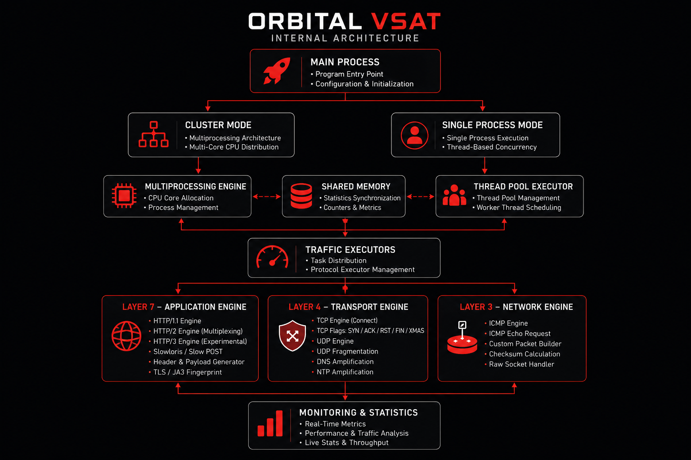

<div align="center">
    
</div>

# VSAT DDOS

Advanced Multi-Layer Network Stress Testing Framework

---


---

# Overview

VSAT (**VOLUMETRIC SOCKET ARTILLERY**) is an advanced multi-layer network traffic generation framework designed for:

- Network stress testing
- Infrastructure benchmarking
- Protocol analysis
- Defensive security research
- High concurrency traffic simulation
- HTTP/2 multiplexing analysis
- TLS JA3 fingerprint experimentation
- Raw socket packet crafting research

The framework combines Layer 3, Layer 4, and Layer 7 traffic engines into a unified multiprocessing architecture capable of generating high-throughput traffic across multiple network protocols.

---

# Features

##  Layer 7 Application Engine

### Supported Methods

| Method  | Status |
| ------- | ------ |
| GET     | YES    |
| POST    | YES    |
| PUT     | YES    |
| PATCH   | YES    |
| DELETE  | YES    |
| OPTIONS | YES    |
| TRACE   | YES    |
| CONNECT | YES    |
| RANDOM  | YES    |

### HTTP Features

- HTTP/1.1 Keep-Alive Engine
- HTTP/2 Multiplexing
- HTTP/2 Priority Frames
- HTTP/2 Ping Frames
- Experimental HTTP/3 Support
- Dynamic Cache Bypass
- Large Payload Requests
- Randomized Query Generation
- Persistent Socket Reuse
- Header Randomization
- User-Agent Rotation
- TLS ALPN Negotiation
- TLS JA3 Fingerprint Simulation
- Payload Generation Engine

---

##  Layer 4 Transport Engine

### Supported Methods

| Method   | Description                  |
| -------- | ---------------------------- |
| TCP      | TCP Connection Simulation    |
| SYN      | SYN Packet Simulation        |
| ACK      | ACK Packet Simulation        |
| RST      | RST Packet Simulation        |
| FIN      | FIN Packet Simulation        |
| XMAS     | FIN + PSH + URG              |
| UDP      | UDP Datagram Generation      |
| UDP-FRAG | UDP Fragmentation            |
| DNS-AMP  | DNS Amplification Simulation |
| NTP-AMP  | NTP Amplification Simulation |

### Layer 4 Features

- Raw TCP Packet Crafting
- TCP Flag Manipulation
- Source IP Randomization
- UDP Datagram Generation
- UDP Fragmentation
- Reflection Simulation
- Amplification Simulation
- Large Datagram Buffers

---

##  Layer 3 Network Engine

### Supported Methods

| Method | Description                 |
| ------ | --------------------------- |
| ICMP   | ICMP Echo Packet Simulation |

### Layer 3 Features

- Raw ICMP Packet Generation
- Custom Checksum Calculation
- Randomized Payload Data
- Raw Socket Communication

---

#  TLS JA3 Fingerprinting

VSAT also supports TLS JA3 fingerprint simulation profiles.

### Available Profiles

| Profile | Browser         |
| ------- | --------------- |
| chrome  | Google Chrome   |
| firefox | Mozilla Firefox |
| safari  | Apple Safari    |

### JA3 Features

- Cipher Suite Ordering
- TLS Curve Selection
- TLS ALPN Negotiation
- TLS Handshake Customization
- TLS 1.2 / TLS 1.3 Support

---

# Internal Architecture



VSAT uses a high-concurrency multiprocessing architecture designed for protocol-level traffic generation and scalable execution across Layer 3, Layer 4, and Layer 7 environments.

The architecture separates workloads into multiple independent traffic engines responsible for different network layers and transport protocols.

---

# Main Components

##  Main Process

- Runtime Initialization
- Target Parsing
- Configuration Loading
- Worker Distribution
- Statistics Monitoring

---

##  Cluster Mode

- Multiprocessing CPU Scaling
- Parallel Worker Execution
- Shared Statistics Synchronization
- High Throughput Traffic Distribution

---

##  Single Process Mode

- ThreadPoolExecutor
- Thread-Based Workers
- Shared Socket Execution
- Lightweight Resource Usage

---

##  Shared Memory System

- Request Counters
- Throughput Monitoring
- Runtime Metrics
- Process Synchronization

---

##  Traffic Executors

- Task Distribution
- Protocol Execution
- Request Generation
- Packet Generation
- Socket Management

---

##  Installation and Usage

```bash
git clone --branch main https://github.com/MatrixTM26/VSAT.git
cd VSAT
go build -o vsat ./cmd/vsat
chmod +x vsat
./vsat
```

---

##  Credit

- **Author:** [@MatrixTM26](https://github.com/MatrixTM26)
- **License:** [AGPL-V3](./LICENSE)

---

<p align="center">Copyright &copy;2023-2026 MatrixTM26 &middot; All Rights Reserved</p>
